# Splatshop (v0.01f)

This editor aims to enable editing of [gaussian splat models](https://github.com/graphdeco-inria/gaussian-splatting), e.g., cleaning up reconstructed models, assembling cleaned-up assets into a library, composing scenes, and painting. It currently supports up to a hundred million splats on desktop and up to around ten million in VR on an RTX 4090. 

There is still a lot of work to do - we are releasing it now in order to gather feedback and figure out which features and fixes to prioritize. 

An example data set is available [here](http://users.cg.tuwien.ac.at/mschuetz/permanent/splatmodels.zip). Unpack it, then drag&drop it into the editor. The garden splat model is from [Inria 3DGS](https://github.com/graphdeco-inria/gaussian-splatting), and originates from [Mip-NeRF 360: Unbounded Anti-Aliased Neural Radiance Fields](https://ieeexplore.ieee.org/stamp/stamp.jsp?tp=&arnumber=9878829). 

A precompiled windows binary is available [here](http://users.cg.tuwien.ac.at/mschuetz/permanent/Splatshop_2025.03.21_v0.01f.zip). However, it may still be necessary to install CUDA 12.4 or later since CUDA kernels are compiled at startup. 

 

### Features

<ul>
	<li> Undo and Redo
	<li> Virtual Reality viewing and editing
	<li> Select via brush, sphere, rectangle; Delete with brush or del button
	<li> Translate, scale, rotate of selected nodes or splats.
	<li> Painting
	<li> No pip or conda issues! (no Python)
	<li> CUDA Driver API - Can edit and hot-reload CUDA code like shaders.
	<li> Includes support for <a href="https://github.com/nerficg-project/HTGS">perspective-correct gaussians</a>. (Splat models need to be trained with respective method)
</ul>

### Known Issues
<ul>
	<li> Academic Prototype - expect a fair amount of bugs and crashes -> Consider it an "alpha" version.
	<li> VR only on windows - No idea how to include OpenVR on linux. 
	<li> No Spherical Harmonics due to large mem req. with modest gains - we will check out more frugal SH options in the future. 
	<li> CUDA Driver API - Long startup because CUDA compiles at runtime. 
	<li> No precompiled binaries yet. 
	<li> Undo and redo may not cover all functionality yet. 
	<li> Undo of translate/scale/rotate is currently lossy. Especially scale is prone to loss of precision when scaling too far down. 
	<li> App freezing: Line rendering caused freezes on RTX 20xx series cards. That was fixed, but there is a chance that triangle models in VR mode may also freeze RTX 20xx series cards. 
</ul>

## Installing

<details>
<summary>Windows</summary>

Dependencies: 
* CUDA 12.4
* Visual Studio 2022 (version 17.10.3)
* CMake 3.27
* RTX 4070 or better recommended. 

Create Visual Studio solution files in a build folder via cmake:

```
mkdir build
cd build
cmake ../
```

Open build/SplatEditor.sln and compile in Release mode.<br>
Then run from project directory. 

```
./build/Release/SplatEditor.exe
```

Running from project directory is semi-important because the editor will look for resources such as ```./src/gaussians_rendering.cu``` and ```./resources/images/symbols_32_32.png``` relative to the project directory. Alternatively, you can copy the resources and src folders into the binary directory.


</details>

<details>
<summary>Linux</summary>

Dependencies:
* gcc 14, g++14
* CUDA 12.4 or higher
* NVIDIA driver version 550 or higher. (Lower may cause issues when compiling GPUSorting)

```
mkdir build
cd build
export CUDA_PATH=/usr/local/cuda-12.8/
cmake -DCUDA_CUDART_LIBRARY=/usr/local/cuda/lib64/libcudart.so ..
make
```

Potential Issues:
- May or may not require TBB. Uncomment the TBB part in CMakeLists, if it does.

```
// set CUDA_PATH variable to wherever your CUDA Toolkit is installed
export CUDA_PATH=/usr/local/cuda-12.4/

// May or may not require setting LD_LIBRARY_PATH to gcc 14, similar to this, or whereever gcc14 is installed
export LD_LIBRARY_PATH=~/gcc-14.1.0/x86_64-linux-gnu/libstdc++-v3/src/.libs:$LD_LIBRARY_PATH

// run from workspace root
./build/SplatPainter
```

</details>

## Getting Started

### Key and Mouse (as hardcoded in ```inputHandlingDesktop.h```)

<table>
	<tr>
		<td>Right Click</td>
		<td>Cancel current action</td>
	</tr>
	<tr>
		<td>Double Click</td>
		<td>Move towards hovered splats</td>
	</tr>
	<tr>
		<td>Ctrl + z, Ctrl + y</td>
		<td>Undo, Redo</td>
	</tr>
	<tr>
		<td>1</td>
		<td>Brush-Selection Action</td>
	</tr>
	<tr>
		<td>2</td>
		<td>Brush-Deletion Action</td>
	</tr>
	<tr>
		<td>t, r, s</td>
		<td>Translate, Rotate, Scale</td>
	</tr>
	<tr>
		<td>b</td>
		<td>Painting</td>
	</tr>
	<tr>
		<td>Ctrl + D</td>
		<td>Duplicate selection to new layer</td>
	</tr>
	<tr>
		<td>Ctrl + E</td>
		<td>Merge selected layer into the one below</td>
	</tr>
</table>

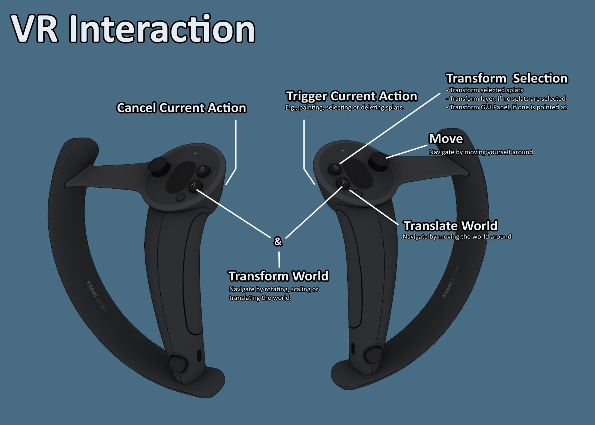

### Delete and Duplicate

<table>
	<tr>
		<td>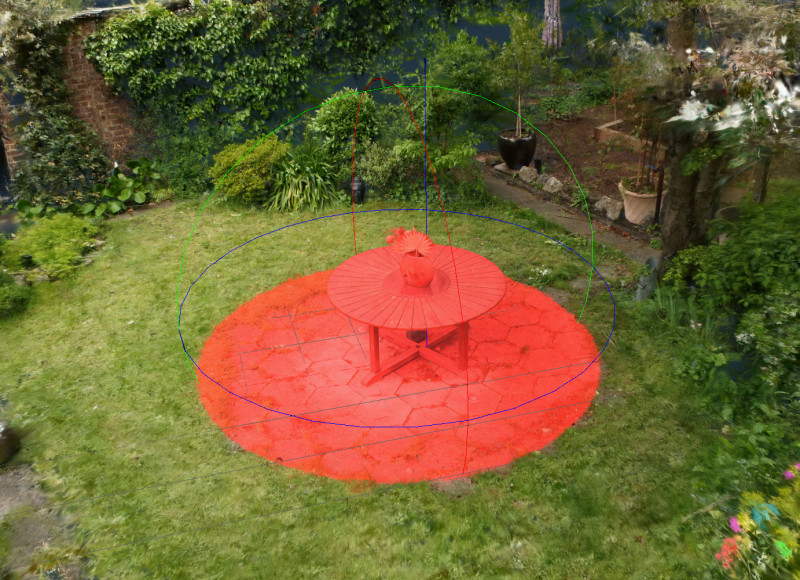1</td>
		<td>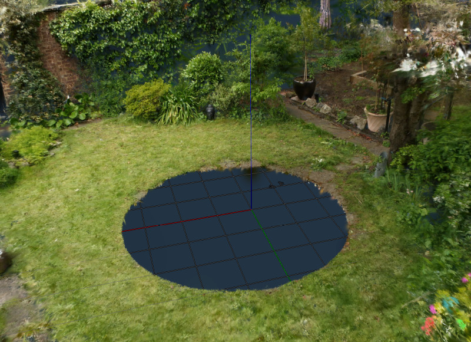2</td>
		<td>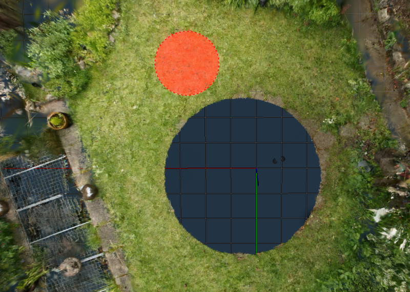3</td>
		</tr><tr>
		<td>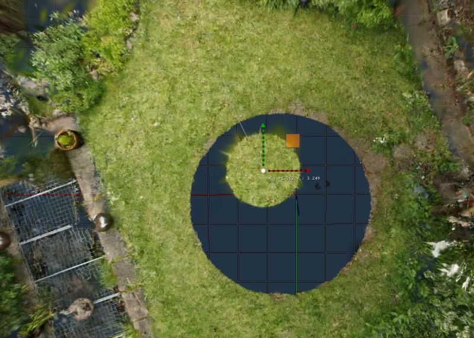4</td>
		<td>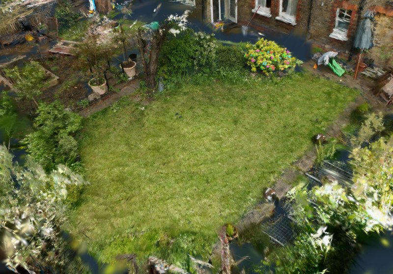5</td>
		<td>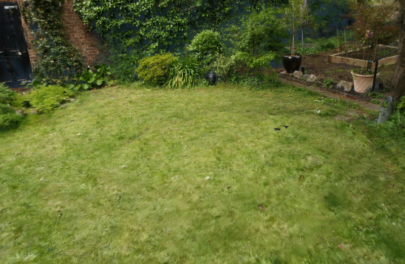6</td>
	</tr>
</table>

1. Select splats with spherical selection brush.
2. Delete selection (key: del).
3. Select a patch of grass with brush selection and intersection set to "center". This avoids selecting nearby large splats.
4. Duplicate selection (key: ctrl + d), then move it with translation tool (key: t). 
5. Repeat with varying patches of grass until the hole is covered. Overlapping lighter and darker patches may result in near-seamless transitions. 

### Cleanup

<table>
	<tr>
		<td>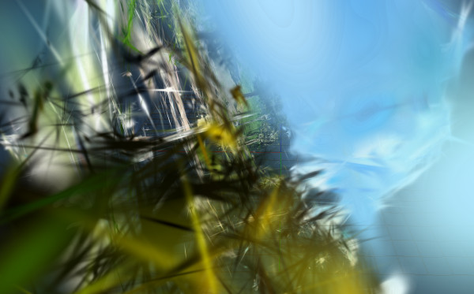1</td>
		<td>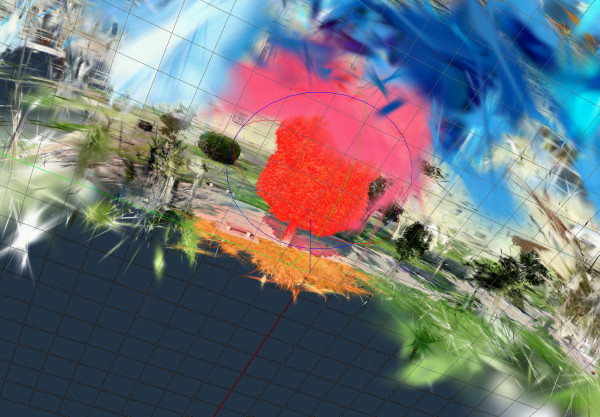2</td>
		<td>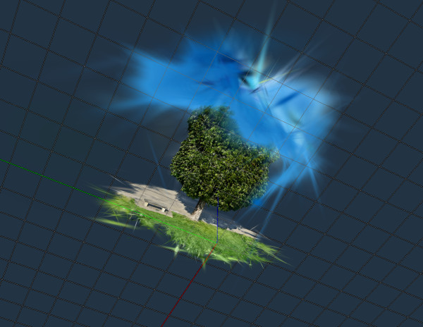3</td>
		<td colspan="2" rowspan="2"></td>
		</tr><tr>
		<td>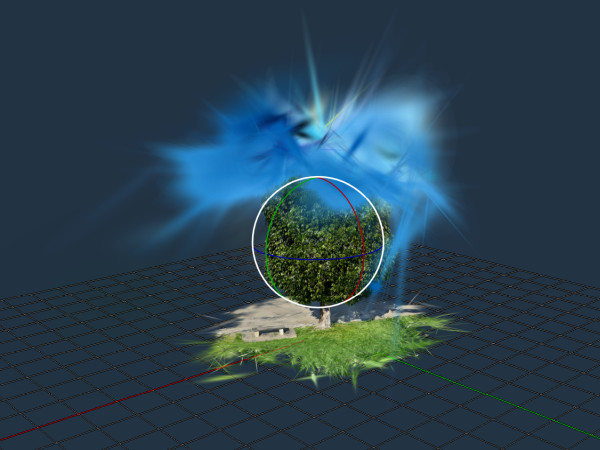4</td>
		<td>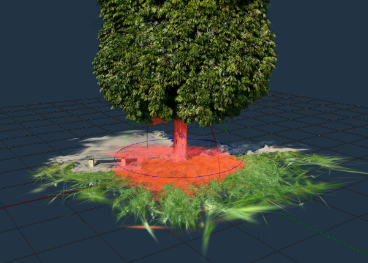5</td>
		<td>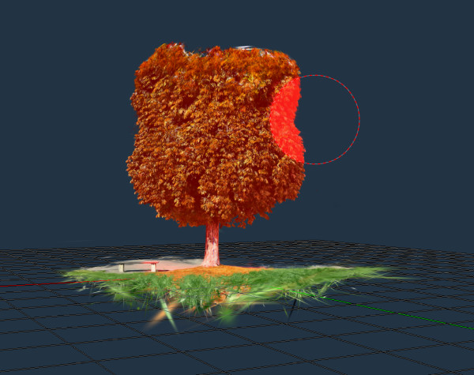6</td>
		<td></td>
	</tr>
</table>

1. Drag&Drop ply file
2. Select region of interest with spherical selection tool. 
3. Invert selection and delete (key: t).
4. Rotate until model aligns with ground plane (key: r) and translate to origin (key: t). If the ground is sufficiently densely reconstructed, you can also try using the 3-point-alignment tool, which aligns the model by specifying three points on the ground. 
5. Remove undesired splats with a combination of circular and spherical selection and deletion tools. To retain a nice circular ground, select splats with a spherical brush
6. Then select the remainder of the splats that should remain. Invert selection and delete.

### Add an asset to library

<table>
	<tr>
		<td>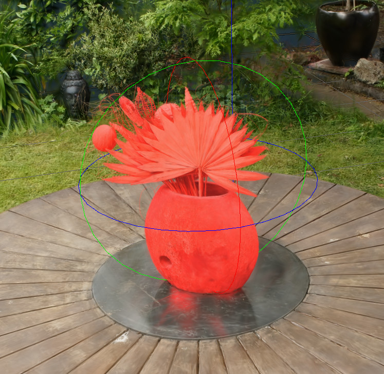</td>
		<td>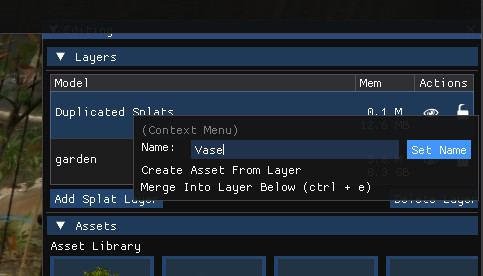</td>
		<td>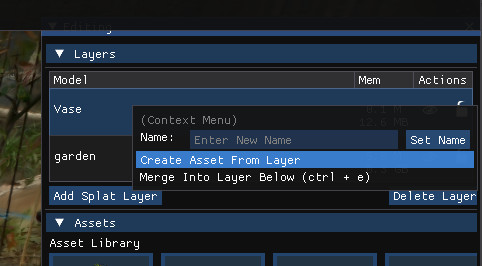</td>
		<td>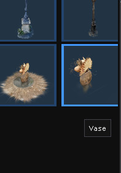</td>
	</tr>
</table>

1. Select splats
2. Duplicate selection (key: ctrl + d)
3. In the layers menu, right click the duplicated layer and give it a new name.
4. Right click the layer again, and select "Create asset from Layer".

### Adding new actions to toolbar

- Choose a suitable existing action and copy it, e.g. [BrushSelectAction](./src/actions/BrushSelectAction.h).
- Rename accordingly and adapt the code to your needs. Perhaps remove the undoable parts for now.
- ```update()``` is called every frame and handles most things. 
- ```makeToolbarSettings()``` allows you do specify an imgui user interface that is shown below the toolbar while your action is active. 
- Add your action to [toolbar.h](src/gui/toolbar.h). Include it and add a Button or ImageButton, similar to other actions. When the button is clicked, create a shared_ptr of your action and call setAction(action) to activate it. It will automatically be deactivated on right-click. 
- If you need to add an icon, you can add one to [symbols.svg](resources/images/symbols.svg) and export it to symbols_32x32.png. 

## Acknowledgements

* Contributors: Markus Schütz, Christoph Peters, Florian Hahlbohm, Elmar Eisemann, Michael Wimmer
* Bernhard Kerbl, Georgios Kopanas, Thomas Leimkühler, George Drettakis for [3D Gaussian Splatting
for Real-Time Radiance Field Rendering](https://repo-sam.inria.fr/fungraph/3d-gaussian-splatting/)
* Mark Kellog for his WebGL implementation https://github.com/mkkellogg/GaussianSplats3D which helped substantially with the 3DGS implementation.
* Thomas Smith for his [GPUSorting](https://github.com/b0nes164/GPUSorting) project that is used to sort the gaussians in this project. 
* Omar's [Dear ImGui](https://github.com/ocornut/imgui). 
* This particular garden model is a pretrained model from [Inria 3DGS](https://repo-sam.inria.fr/fungraph/3d-gaussian-splatting/) and rotated to fit our editor. The garden data set originates from [Mip-NeRF 360: Unbounded Anti-Aliased Neural Radiance Fields](https://ieeexplore.ieee.org/stamp/stamp.jsp?tp=&arnumber=9878829).
